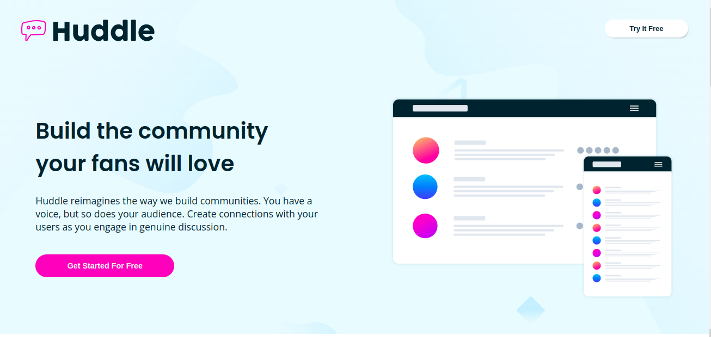

# Huddle landing page with alternating feature blocks

## Welcome! 👋

Thanks for checking out this front-end coding challenge.

[Frontend Mentor](https://www.frontendmentor.io) challenges help you improve your coding skills by building realistic projects.

To do this challenge, you need a basic understanding of HTML and CSS.

## The challenge

Your challenge is to build out this landing page and get it looking as close to the design as possible.

Your users should be able to:

- View the optimal layout for the site depending on their device's screen size
- See hover states for all interactive elements on the page

## Table of contents

- [Overview](#overview)
  - [The challenge](#the-challenge)
  - [Screenshot](#screenshot)
  - [Links](#links)
- [My process](#my-process)
  - [Built with](#built-with)
  - [What I learned](#what-i-learned)
  - [Continued development](#continued-development)
  - [Useful resources](#useful-resources)
- [Author](#author)
- [Acknowledgments](#acknowledgments)

## Overview

### The challenge

Your users should be able to:

- View the optimal layout for the site depending on their device's screen size
- See hover states for all interactive elements on the page

### Screenshot

### Links

- Solution URL: 
- Live Site URL: [https://huddle-landing-page-liard-two.vercel.app/](https://huddle-landing-page-liard-two.vercel.app/)

## My process

### Built with

- Semantic HTML5 markup
- CSS custom properties
- Flexbox
- CSS Grid
- Mobile-first workflow

## What I learned

This project reinforced my understanding of CSS custom properties and responsive design principles. I learned how to effectively use Flexbox and CSS Grid to create a layout that adapts well to different screen sizes.

## Continued development

Use this section to outline areas that you want to continue focusing on in future projects. These could be concepts you're still not completely comfortable with or techniques you found useful that you want to refine and perfect.

## Useful resources

- [MDN Web Docs](https://developer.mozilla.org/en-US/) - A great resource for web development documentation and tutorials.
- [CSS Tricks](https://css-tricks.com/) - This site has fantastic articles on CSS and front-end development.

## Author

- Frontend Mentor - [@Gehadazzam](https://www.frontendmentor.io/profile/Gehadazzam)
- Twitter - [@Gehad1984](https://www.twitter.com/Gehad1984)

## Acknowledgments

I'd like to thank the Frontend Mentor community for their feedback and support throughout this challenge.
